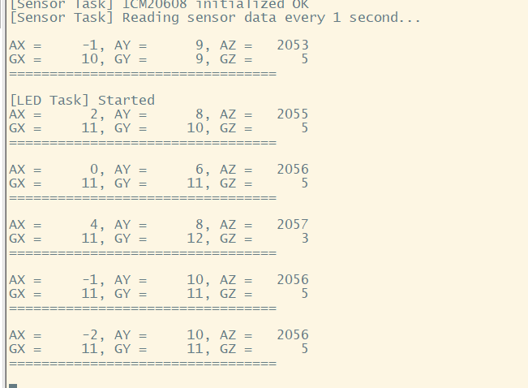
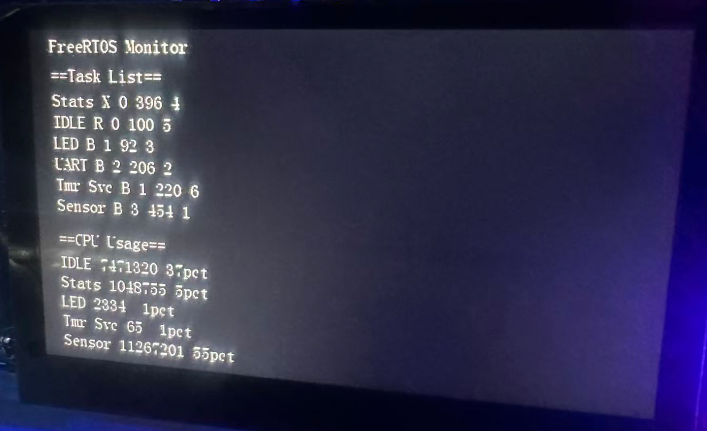

# From Bare Metal to RTOS

**RTOS is essentially a bare-metal program, but it provides task scheduling, task statistics, and many other useful features on top of that. It's an excellent scheduling system for bare-metal applications.**

This project is a Practical Guide to FreeRTOS on ARM Cortex-A7, Step-by-step migration with real performance data and debugging **insights**.

## Introduction

   - Why migrate from bare metal to RTOS?

     In bare metal systems, all tasks run in a single main loop, and developers must manually manage timing, priorities, and resource sharing. 

     RTOS (Real-Time Operating System) provides built-in task scheduling, inter-task communication, and resource management, making it much easier to build reliable, modular, and responsive embedded applications.
   - Project goals

     ​	3 steps : basic RTOS port -- UART send task -- LCD task monitor
   - Hardware: IMX6ULL (Cortex-A7, 528MHz)

## Stage 1 Basic FreeRTOS Port

### `FreeRTOSConfig.h`

basic config file for porting FreeRTOS.

```c
// basic sys config
#define configCPU_CLOCK_HZ          528000000   // Match your CPU frequency
#define configTICK_RATE_HZ          1000        // 1ms per tick (1000Hz)
#define configMAX_PRIORITIES        5           // Number of priority levels
#define configTOTAL_HEAP_SIZE       (24 * 1024) // Total heap memory (adjust based on RAM)

// interrupt 
#define configUNIQUE_INTERRUPT_PRIORITIES       32
#define configMAX_API_CALL_INTERRUPT_PRIORITY   20

// click Timer
extern void vConfigureTickInterrupt(void);
extern void vClearTickInterrupt(void);
#define configSETUP_TICK_INTERRUPT()    vConfigureTickInterrupt()
#define configCLEAR_TICK_INTERRUPT()    vClearTickInterrupt()

// ARM Cortex-A Specific: GIC Interrupt Controller
#define configINTERRUPT_CONTROLLER_BASE_ADDRESS         0x00A01000
#define configINTERRUPT_CONTROLLER_CPU_INTERFACE_OFFSET 0x1000
```

### `freertos_port.c`

The `freertos_port.c` file implements hardware-specific functions required by FreeRTOS, such as tick timer setup and interrupt handling, to enable proper task scheduling on the IMX6ULL platform.

```c
// Sets up a hardware timer to generate periodic interrupts for task switching
vConfigureTickInterrupt()
{
	// init && config GPT
	...
	// set handler
	system_register_irqhandler(GPT1_IRQn, (system_irq_handler_t)freertos_gpt1_irq_handler, NULL);
	
}
// basic timer handler for rtos scheduling 
void freertos_gpt1_irq_handler(unsigned int giccIar, void *param)
{
    // clear interrupt flag
    GPT1->SR = 1 << 0;
    // next time value every 1ms
    GPT1->OCR[0] = GPT1->CNT + 1000;  // 1000 ticks = 1ms
    
    // Call FreeRTOS tick increment
    if (xTaskIncrementTick() != pdFALSE) {
        // Need to perform task switching
        portYIELD();
    }
}
```

### basic RTOS task func

```c
int main()
{
    // Create Task 1: LED Heartbeat
    BaseType_t ret1 = xTaskCreate(
    led_task,               /* Task function */
    "LED",                  /* Task name */
    256,                    /* Stack size (words) */
    NULL,                   /* Parameter */
    1,                      /* Priority */
    &led_task_handle        /* Task handle */
	);
    // Create Task 2: Sensor Reading
    BaseType_t ret2 = xTaskCreate(
        sensor_task,
        "Sensor",
        512,
        NULL,
        2,
        &sensor_task_handle
    );
    
    // start FreeRTOS scheduler  -- never quit
    vTaskStartScheduler();
    
    // failed print -- if scheduler quit that is error
    printf("[FATAL ERROR] FreeRTOS scheduler failed to start!\r\n");
}

void led_task(void *param)
{
    printf("[LED Task] Started\r\n");
    while(1) 
    {
        led0_switch();
        vTaskDelay(pdMS_TO_TICKS(500));  // Blink every 500ms
    }
}
void sensor_task(void *param)
{
    printf("[Sensor Task] Started\r\n");
    printf("[Sensor Task] Initializing ICM20608...\r\n");
    while(1) 
    {
        // Read sensor data
        icm20608_read_data(&accel_x, &accel_y, &accel_z, &gyro_x, &gyro_y, &gyro_z);
        // Print
        printf("AX = %6d, AY = %6d, AZ = %6d\r\n", accel_x, accel_y, accel_z);
        printf("GX = %6d, GY = %6d, GZ = %6d\r\n", gyro_x, gyro_y, gyro_z);
        printf("=================================\r\n\r\n");
        // Delay 1000ms
        vTaskDelay(pdMS_TO_TICKS(1000)); 
    }
}
```

### Result

snapshot



Successfully ported FreeRTOS to IMX6ULL,  the final system implements stable multitasking scheduling.

RTOS provides significant advantages over bare metal in terms of real-time performance, maintainability, and task isolation, making it the preferred architecture for complex embedded systems.

## Stage 2 UART send

In this stage, I ported all functionality from the previous [uart_optimization](https://github.com/xbs5520/xbs-imx6-labs/tree/main/Labs/uart_optimization) project to FreeRTOS. 

This allowed me to compare performance and behavior between bare-metal implementation and RTOS task scheduling.

### sensor timer

Since GPT1 is already used by RTOS as the system tick timer, we need to use another timer (GPT2) for sensor sampling.

```c
void sensor_timer_irq_handler(unsigned int giccIar, void *param)
{
    // Clear interrupt flag
    GPT2->SR = 1 << 0;
    
    // Update next compare value 50ms
    GPT2->OCR[0] = GPT2->CNT + 32250;  // 645kHz * 50ms = 32250 ticks

    // Give semaphore and check if immediate context switch needed
    BaseType_t xHigherPriorityTaskWoken = pdFALSE;
    xSemaphoreGiveFromISR(timer_semaphore, &xHigherPriorityTaskWoken);
    // Yield based on return value
    portYIELD_FROM_ISR(xHigherPriorityTaskWoken);
}
```

### semaphore

`SemaphoreHandle_t timer_semaphore = xSemaphoreCreateBinary();`

A binary semaphore used to synchronize the sensor task with the GPT2 timer interrupt. 

Every 50ms, the timer ISR releases the semaphore, waking up the sensor task to collect data - this provides precise timing and efficient CPU usage.

### ring buffer

`QueueHandle_t uart_queue = xQueueCreate(16, sizeof(sensor_packet_t));`

A FreeRTOS message queue (RTOS equivalent of a ring buffer).  This provides thread-safe, lock-free communication between tasks with automatic blocking/waking mechanisms.

### main func

```c
void uart_task2(void *param)
{
    printf("[UART Task] Started, waiting for data from queue...\r\n");
    while(1) {
        // Receive data from queue
        // Block and wait until queue has data
        if (xQueueReceive(uart_queue, &packet, portMAX_DELAY) == pdPASS) 
        {
            // send
            ...
        }
    }
}
void sensor_task2(void *param)
{
    // Start GPT2 after scheduler is running (safe)
    sensor_timer_start();
    while(1) 
    {
        // Block waiting for semaphore
        xSemaphoreTake(timer_semaphore, portMAX_DELAY);
        // read data
        ...
        // Send to UART queue (non-blocking, returns immediately)
        xQueueSend(uart_queue, &packet, 0);
    }
}
// main loop
// Create tasks
xTaskCreate(sensor_task2, "Sensor", 512, NULL, 3, NULL);  // Priority 3
xTaskCreate(uart_task2, "UART", 256, NULL, 2, NULL);      // Priority 2
xTaskCreate(led_task2, "LED", 128, NULL, 1, NULL);        // Priority 1
```

### result

| Metric | Bare Metal IRQ+RingBuffer | FreeRTOS Async UART |
|--------|---------------------------|---------------------|
| **Sampling Interval** | 50.00ms ± 0.05ms | 50.005ms ± 1.101ms |
| **Jitter** | **±0.05ms** (0.1%) | ±1.101ms (2.2%) |
| **UART Send** | 0.06ms | **0.06ms** |
| **CPU Usage** | 59.5% | **59.5%** |
| **Task Count** | N/A (single thread) | 3 |

RTOS introduces some scheduling overhead that reduces real-time performance (increased jitter), but it provides a better task scheduling system and APIs. 

This makes it easier to extend functionality, collect statistics, and add new tasks in the future.

## Stage3 Lcd Monitor

### Add stats task

```c
void stats_task2()
{
    while(1) {
        vTaskDelay(pdMS_TO_TICKS(2000));  // Update LCD every 2 seconds
        // Display stats on LCD
        lcd_display_stats();
    }
}
void lcd_display_stats()
{
    // Get task list
    vTaskList(g_stats_buffer);
    // Get runtime statistics (use second buffer)
    vTaskGetRunTimeStats(g_stats_buffer2);
    // show on lcd
    ...
}
// main loop
// Create tasks
xTaskCreate(sensor_task2, "Sensor", 512, NULL, 3, NULL);  // Priority 3 (highest)
xTaskCreate(uart_task2, "UART", 256, NULL, 2, NULL);      // Priority 2
xTaskCreate(led_task2, "LED", 128, NULL, 1, NULL);        // Priority 1
xTaskCreate(stats_task2, "Stats", 512, NULL, 0, NULL);    // Priority 0
```

### Result

Implemented complete runtime statistics functionality，LCD real-time display clear.

| Task | LCD Display | Description |
|------|-------------|-------------|
| Sensor | 55% | ICM20608 read takes 29.7ms |
| IDLE | 37% | System idle |
| Stats | 5% | LCD update (2s period) |
| LED | 1% | 500ms blink |
| TMR | 1% | Software timer service |
| UART | <1% | Async send, minimal CPU |



## Key Lessons Learned

### RTOS ≠ Better Performance (It's About Architecture)

One of the most important findings from this project is that **migrating to RTOS doesn't automatically improve performance**. In fact, the scheduling overhead introduced jitter from ±0.05ms to ±1.1ms - a 20x increase. However, RTOS provides significant architectural benefits:

- **Task isolation**: Each task has its own stack and context, making debugging easier
- **Priority-based scheduling**: Critical tasks always execute first
- **Rich synchronization primitives**: Semaphores, queues, mutexes simplify inter-task communication
- **Better code organization**: Functionality is cleanly separated into independent tasks
- **Easier to extend**: Adding new features requires only creating new tasks without affecting existing code

### When to Choose Bare Metal vs RTOS

**Use Bare Metal when:**
- Simple single-function applications (e.g., basic LED control)
- Hard real-time requirements (<1ms jitter critical)
- Very limited RAM (<2KB available)
- Absolute minimum power consumption needed
- Learning embedded systems from scratch

**Use RTOS when:**
- Multiple independent functions need to run concurrently
- Priority-based scheduling required
- Complex inter-task communication and synchronization
- System needs to be easily maintainable and extensible
- Team development with different modules
- Need built-in debugging and profiling features

## Conclusion & Resources

This project demonstrates a complete journey from bare metal to FreeRTOS on ARM Cortex-A7, covering:

**Stage 1**: Successfully ported FreeRTOS, solved 3 critical hardware configuration bugs  
**Stage 2**: Migrated real-world UART streaming application, measured performance trade-offs  
**Stage 3**: Implemented runtime monitoring with LCD display, analyzed 6-task system behavior  

### Source Code Repository

All source code, build scripts, and documentation are available on GitHub:

**Repository**: [freertos_migration](https://github.com/xbs5520/xbs-imx6-labs/tree/main/Labs/freertos_migration)

**Related Projects**:

- [UART Optimization Lab](https://github.com/xbs5520/xbs-imx6-labs/tree/main/Labs/uart_optimization) - Bare metal baseline for comparison

---

**Final Thoughts**

This project proves that RTOS is not a magic bullet for performance, but rather a powerful tool for building maintainable, scalable embedded systems. The key is understanding the trade-offs and choosing the right tool for the job. For complex projects with multiple concurrent functions, the architectural benefits of FreeRTOS far outweigh the slight increase in timing jitter.

**Project Status**: ✅ Completed 
**Author**: xbs5520 
**Date**: October 2025 
**Platform**: IMX6ULL (ARM Cortex-A7, 528MHz) 
**License**: Open Source

