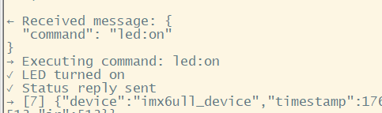

# Building an IMX6ULL IoT System: From Local MQTT to AWS Cloud Integration

## Introduction

The main reason for doing the MQTT AWS IoT project is to enable reliable, real-time communication between embedded devices and the cloud. This allows remote monitoring, control, and data analysis, which are essential for modern IoT applications.

This project include 3 main steps:

basic mqtt test -> 2-way communication -> aws IOT + mqtt

**environment**

- **Hardware:** IMX6ULL (Cortex-A7), AP3216C sensor
- **OS:** Linux
- **Libraries:** OpenSSL 3.0.15, cJSON, Mosquitto 2.0.18
- **debugging:** NFS root filesystem mount

## mqtt basic

environment setup

- Installed Mosquitto broker on PC(linux)
- Cross-compiled mosquitto library for ARM platform

**signal handler**

using signal hander for ctrl + c or kill --> process can handler than and release resource first before quit. 

register  `signal(SIGINT, signal_handler); `

```
// handler
void signal_handler(int sig) 
{
    printf("\nCaught signal %d, exiting...\n", sig);
    running = 0;
}
```

**call back**

basic mqtt func for communication, you can handle connection, disconnect and publish ect.

register `mosquitto_connect_callback_set(mosq, on_connect);`

```
void on_connect(struct mosquitto *mosq, void *obj, int rc) 
{
    printf("Connected to MQTT broker! Return code: %d\n", rc);
    if (rc == 0) 
    {
        printf("Connection successful!\n");
    } 
    else 
    {
        printf("Connection failed!\n");
    }
}
```

**mqtt connection**

```c
int main()
{
	//create instance
	mosq = mosquitto_new(CLIENT_ID, true, NULL);
	
    // Connect to broker    60-keepAlive
    rc = mosquitto_connect(mosq, MQTT_HOST, MQTT_PORT, 60);

    // Start network loop (non-blocking)
    mosquitto_loop_start(mosq);
    while (running) 
    {
    	//publish
        mosquitto_publish(mosq, NULL, MQTT_TOPIC, strlen(message), message, 0, false);
        sleep(1);
    }
}
```

## mqtt 2-way communication

**GPIO control via sysfs interface**

```c
// Map GPIO registers to memory
static void* map_gpio_registers(unsigned long base_addr) 
{
    int fd = open("/dev/mem", O_RDWR | O_SYNC);
    if (fd < 0) {
        perror("open /dev/mem");
        return NULL;
    }
    // 0x1000 = 4KB -- whole page
    void* ptr = mmap(NULL, 0x1000, PROT_READ | PROT_WRITE, MAP_SHARED, fd, base_addr);
    close(fd);
    
    return ptr;
}
// gpio1_base = map_gpio_registers(GPIO1_BASE);
// gpio5_base = map_gpio_registers(GPIO5_BASE);
// Control LED (GPIO1_IO03)
void led_control(int on) 
{
    if (!gpio1_base) return;
    // DR offset
    volatile unsigned int* gpio1_dr = (unsigned int*)(gpio1_base + GPIO_DR);
    
    if (on)
        *gpio1_dr &= ~(1 << 3);  // low = on
    else
        *gpio1_dr |= (1 << 3);   // high = off
}
void beep_control(int on) 
{
    if (!gpio5_base) return;
    
    volatile unsigned int* gpio5_dr = (unsigned int*)(gpio5_base + GPIO_DR);
    
    if (on)
        *gpio5_dr &= ~(1 << 1);  // low = on
    else
        *gpio5_dr |= (1 << 1);   // high = off
}
```

**I2C sensor data reading through ioctl system calls**

```c
int ap3216c_init(void)
{
    // 1. Open I2C device
    i2c_fd = open(I2C_DEVICE, O_RDWR);
    
    // 2. Set slave address
    ioctl(i2c_fd, I2C_SLAVE, AP3216C_ADDR)
    
    // 3. Soft reset
    i2c_write_reg(AP3216C_SYSTEMCONG, 0x04);
    
    // 4. Set to ALS+PS+IR mode
    i2c_write_reg(AP3216C_SYSTEMCONG, 0x03);
}
// Read register
static int i2c_read_reg(unsigned char reg, unsigned char *buf, int len) 
{
    // I2C read flow:
    // 1. write 1 byte to set register address
    if (write(i2c_fd, &reg, 1) != 1) {
        perror("i2c write reg addr");
        return -1;
    }
    // 2. Then read data from that register
    if (read(i2c_fd, buf, len) != len) {
        perror("i2c read");
        return -1;
    }
    return 0;
}
// Write register
static int i2c_write_reg(unsigned char reg, unsigned char value) 
{
    unsigned char buf[2] = {reg, value};
    if (write(i2c_fd, buf, 2) != 2) {
        perror("i2c write");
        return -1;
    }
    return 0;
}
```

**message handler**   board to pc

```c
void on_message(struct mosquitto *mosq, void *obj, const struct mosquitto_message *msg) 
{
    char *payload = (char*)msg->payload;
    char response[64];

    // Parse command
    if (strncmp(payload, "led:on", 6) == 0) 
    {
        led_control(1);  // low level = on
        strcpy(response, "led:on");
    }
    else if
    ...
    
    // Publish status feedback
    mosquitto_publish(mosq, NULL, STATUS_TOPIC, strlen(response), response, 0, false);
}
```

**JSON format**

JSON is a universal format that can be used for communication between many different systems.

```c
// Create JSON object
cJSON *root = cJSON_CreateObject();
cJSON *data = cJSON_CreateObject();

// Add device info
cJSON_AddStringToObject(root, "device", CLIENT_ID);
cJSON_AddNumberToObject(root, "timestamp", time(NULL));
cJSON_AddNumberToObject(root, "count", count++);

// Add sensor data
cJSON_AddNumberToObject(data, "ir", sensor_data.ir);
cJSON_AddNumberToObject(data, "als", sensor_data.als);
cJSON_AddNumberToObject(data, "ps", sensor_data.ps);
cJSON_AddItemToObject(root, "data", data);

// Convert to JSON string
char *json_str = cJSON_PrintUnformatted(root);

// Publish message
mosquitto_publish(mosq, NULL, SENSOR_TOPIC, strlen(json_str), json_str, 0, false);
```

## aws IOT

After 2-way communication next step is connecting to aws-service for remote communication .

**AWS register flow**

create things in devices --> create policy --> download cert --> get end point


Endpoint(domain name)


**connection setting**

```c
mosq = mosquitto_new(AWS_IOT_CLIENT_ID, true, NULL);
// MQTT 3.1.1
mosquitto_int_option(mosq, MOSQ_OPT_PROTOCOL_VERSION, MQTT_PROTOCOL_V311);

// Configure TLS/SSL
rc = mosquitto_tls_set(mosq, AWS_CERT_CA, NULL, AWS_CERT_CRT, AWS_CERT_KEY, NULL);

// Connect to AWS IoT
rc = mosquitto_connect(mosq, AWS_IOT_ENDPOINT, AWS_IOT_PORT, 60);
```

**openssl version ！！**

Initially, I used OpenSSL 1.1.1, but it failed to connect with protocol errors. 

After upgrading to OpenSSL 3.0.15, the connection succeeded!

**result**

Successfully connected to AWS IoT service with the following capabilities:

**Data Upload (Device → Cloud)**

- Board publishes sensor data every 2 seconds
- Data visible in AWS IoT Core console in real-time
- Topic: `imx6ull/sensor`


**Remote Control (Cloud → Device)**

- Send commands from AWS IoT console
- Control LED: `led:on` / `led:off`
- Control BEEP: `beep:on` / `beep:off`




## Conclusion

This project demonstrates a complete journey from **local MQTT testing** to **AWS IoT cloud integration** on an embedded Linux platform. I successfully built a remote-controllable IoT system with real-time sensor monitoring.