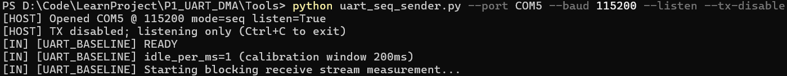
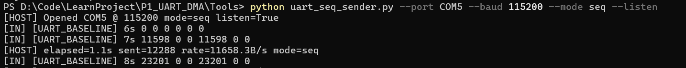

# P1 UART DMA

## 0 Project info

### High-level Goal

Build a reliable, **zero‑data‑loss** UART receive path.

Blocking poll --> IRQ + Ring Buffer --> DMA Double Buffer

while measuring CPU headroom with comparable metrics at every step.

### Motivation

Pure blocking polling wastes CPU time during idle gaps and risks overruns during bursts.

A staged approach lets us prove correctness first, then optimize.

### Iteration  Roadmap 

迭代

|    Stage    |             Description             |           CN            |         Core Risk         |
| :---------: | :---------------------------------: | :---------------------: | :-----------------------: |
| 1 Baseline  | Blocking read + opportunistic drain |  阻塞读取 + 机会式清空  | fake loss && print block  |
| 2 Interrupt |      UART RX IRQ + ring buffer      |     中断 + 环形缓冲     | High frequency  Interrupt |
|  3 DMA A/B  |    DMA double buffer (half/full)    | DMA 双缓冲（半/满中断） |  complex config && sync   |


## 1 Baseline

### Create a Sender

Write a host Python sender script generating a repeating 0..255 byte sequence to create a verifiable stream for gap/overrun detection; it waits for the target’s “READY” line before starting.

&& Adjust to match the pre-sync window requirement (continuous increment threshold).

`Doc/uart_seq_sender.py`

```bash
#usage
#step 1
python uart_seq_sender.py --port COM5 --baud 115200 --listen --tx-disable
#step 2 when get READY CTRL+C && next CMD
python uart_seq_sender.py --port COM5 --baud 115200 --mode seq --listen
```





### Baseline 01

#### Baseline Design Rationale

- pre-sync
  - pre-sync requires a short run (≥4) of strictly consecutive bytes before starting official metrics.
  - filtering out startup garbage or bytes that arrived before firmware was ready.
- drain
  - (non-blocking FIFO sweep) immediately empties all currently buffered UART RX bytes so the next blocking wait truly stalls on the first byte of a new burst and reduces FIFO overflow risk.
- interleaved drain during print
  - Interleaving drain calls while printing long log lines prevents TX wait latency from letting RX bytes accumulate into artificially large bursts.
- legacy busy%
  - get from an idle-loop counter (1 − idle/ideal_idle)

#### `Main loop`

`init` -> `print READY` -> `200ms idle calibration`(校准) -> `main loop`

`main loop` :

blocking read uint8(char) -> statistics

#### Main functions

`uart_read_seq_and_account` :  blocking read char

`uart_account_byte` : sync && statistics

`uart_drain_nonblocking` : non‑blocking sweep empties all bytes currently sitting in the UART hardware FIFO so the next blocking read truly waits for the first byte of a new burst

`uart_drain_nonblocking` --> only in baseline IRQ && DMA will replace it.

#### fake lose & print block

Add a pre-sync window (require ≥4 consecutive increments before zeroing and starting official metrics)

chunk printing with interleaved `uart_drain_nonblocking`

opportunistic RX servicing inside `putc` while waiting for TX ready.

#### Baseline Freeze Snapshot


#### Metrics 指标

| Metric               | Value (Example Run)    | Notes                                                        |
| :------------------- | :--------------------- | :----------------------------------------------------------- |
| CPU Busy % (legacy)  | 0–2% *heuristic*       | old Algorithm ：get from idle_counter -> theoretical_idle Affected by printing/waiting disturbances |
| Sustained throughput | ≈11.5–11.6 KB/s        | 115200 -> 11.52 KB/s，ok                                     |
| Overrun count        | 0                      | ≥10s running 0                                               |
| Lost bytes           | 0                      | no gap after pre-sync；increase by order                     |
| Max burst length     | total bytes so far     | no lost                                                      |
| First-second loss    | 0                      | avoid by pre-sync                                            |
| Startup sync latency | <5 ms after first data | pre-sync                                                     |
| Print impact         | 可控                   | 分片打印 + TX 等待期 opportunistic drain                     |

#### Issue & Next Step

CPU Busy  get from idle_counter -> theoretical_idle Affected by printing/waiting disturbances

--> change Algorithm
