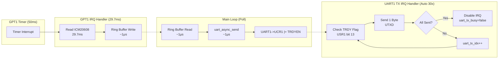

# UART Performance Optimization

System Requirements

\- Read ICM20608 sensor data at ***\*20Hz\**** (50ms period)

\- Transmit 30-byte packets via UART to PC

\- Leave CPU headroom for other tasks (LED, future RTOS)

## Conclusion

The system reads data from an ICM20608 6-axis IMU sensor at 20Hz and transmits it to a PC via UART at 115200 baud.

This mini project include 3 main steps:

**baseline(polling) -> IRQ + ring buffer -> DMA(simulate)**

Optimized performance of UART.

improve of CPU busy:

**67.5%(not available for other tasks) -> 67.5%(available) -> 59.5%(available) **

improve of average send time:

**4ms -> 0.06ms**

## Data flow

1. read from icm20608(6-axis IMU sensor) with SPI

2. put process time(read time) and send time into data(important data).
   - How to get send time for this time? -- can't record this time -> record last time.

3. send data from board to PC with COM serial port.

4. record and calculate data with same python script.

## Polling Baseline

blocking send mode wait for UART is ready then send next byte.

Because the target sampling period is 50ms, the CPU must busy-wait for the remaining time to maintain accurate timing.

```c
// blocking send
void uart_send_blocking(uint8_t *data, uint32_t len)
{
    // wait for uart ready
    while(((UART1->USR2 >> 3) & 0x01) == 0) {}
    // Send one byte
    UART1->UTXD = data[i] & 0xFF;
}

// main loop -- 50ms period
while(1)
{
    // blocking read
    icm20608_read_data();
    // blocking send 
    uart_send_blocking();
    // wait until 50ms
    while(get_system_tick() < next_tick);
}
```

50ms period breakdown:

| state                      | time   |
| -------------------------- | ------ |
| Sensor read                | 29.7ms |
| UART send                  | 4.0ms  |
| wait(can't do other tasks) | 16.3ms |

CPU busy -> 67.5%  for tasks -> 100%

## IRQ + ring buffer

```c
// IRQ handler 50ms period
void gpt1_irq_handler(void)
{
    // read data
    icm20608_read_data();
    // put into ring buffer
    ring_buffer_write();
}

// main loop
while(1)
{
    // if ring buffer has data then blocking send
    if(ring_buffer_avaliable())
    {
        uart_send_blocking();
	}
    else
    {
        // other tasks
        // if(10 IRQ) --> led_switch();
	}
}
```

50ms period breakdown:

| state       | time   |
| ----------- | ------ |
| Sensor read | 29.7ms |
| UART send   | 4.0ms  |
| other tasks | 16.3ms |

CPU busy -> 67.5% && can do other tasks for idle time 

## DMA(simulate)

```c
// Non-blocking send 
// return immediately
int uart_async_send(uint8_t *data, uint32_t len)
{
    // Previous TX not complete
    if (uart_tx_busy) return -1; 
    // copy to uart_tx_buffer
    memcpy(uart_tx_buffer, data, len);
    // enable UART TX IRQ
    UART1->UCR1 |= (1 << 13);
    return 0; //return immediately
}
// UART TX IRQ handler 
// If uart_tx_buffer has data, the IRQ will keep triggering
void uart1_tx_irq_handler(void)
{
    if(UART1->USR1 & (1 << 13))
    {
        // not send all
        if(uart_tx_idx < uart_tx_len)
        {
           	// send 1 byte
        	UART1->UTXD = uart_tx_buffer[uart_tx_idx] & 0xFF;
        }
        // send all
        if(uart_tx_idx >= uart_tx_len)
        {
            // disable UART TX IRQ
            UART1->UCR1 &= ~(1 << 13);
            // set uart free
            uart_tx_busy = false;
        }

	}
}
// main loop
while(1)
{
    if(ring_buffer_avaliable() > 0 && !uart_async_is_busy())
    {
        // send -- return immediately
    	int ret = uart_async_send((uint8_t*)&packet, sizeof(packet));
	}
    else
    {
        //other tasks
    }
}
```

50ms period breakdown:

| state       | time    |
| ----------- | ------- |
| Sensor read | 29.7ms  |
| UART send   | 0.06ms  |
| other tasks | 20.24ms |

CPU busy -> 59.5% && can do other tasks for idle time 

**DMA flow**



**Why "Simulate" DMA?**

- **True DMA**: IMX6ULL uses complex SDMA (requires script loading)
- **Approach**: Interrupt-driven async TX (functionally equivalent for small packets)
- **Benefit**: Achieves DMA-like CPU offloading with simpler implementation
- **Trade-off**: 30 interrupts (30μs) vs true DMA (0 interrupts), but still 98.5% faster than blocking

## Performance Comparison

**Metric**

| Metric             | Baseline        | IRQ + Ring Buffer | Async UART (DMA-like) | Improvement |
| ------------------ | --------------- | ----------------- | --------------------- | ----------- |
| **UART Send Time** | 4.0ms           | 4.0ms             | **0.06ms**            | **↓ 98.5%** |
| **CPU Usage**      | 67.5%           | 67.5%             | **59.5%**             | **↓ 8%**    |
| **Main Loop**      | Blocked         | Available         | Available             | ✅           |
| **Idle Time**      | 16.3ms (wasted) | 16.3ms (usable)   | **20.24ms** (usable)  | **↑ 24%**   |
| **Response Time**  | ~4ms            | ~4ms              | **< 0.1ms**           | **↓ 97.5%** |

**Timing Breakdown (50ms period)**

```
Baseline: [========Sensor 29.7ms========][==UART 4ms==][====Wait 16.3ms====]
↑ CPU blocked

IRQ: [========Sensor 29.7ms========]
↓ (interrupt)
[==UART 4ms==][========Idle 16.3ms (available)==============]

Async UART: [========Sensor 29.7ms========]
↓ (interrupt)
[UART 0.06ms][=============Idle 20.24ms (available)==============]
↑ (30 interrupts in background)
```

## Future Improvements

A. SPI DMA: Optimize sensor read (29.7ms → ?)  now read time is bottleneck

B. FreeRTOS Migration: Separate sensor/UART/LED into tasks

## References

**Code Repository**

- [GitHub: xbs-imx6-labs](https://github.com/your-username/xbs-imx6-labs)
  - `Stage3 Async DMA UART/bsp/bsp_uart_async.c` - Async UART implementation
  - `Stage3 Async DMA UART/irq_dma.c` - Stage 3 main loop
  - `Docs/stage3_work_log.md` - Complete debugging journey

